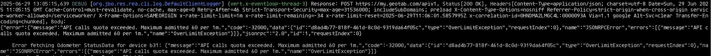
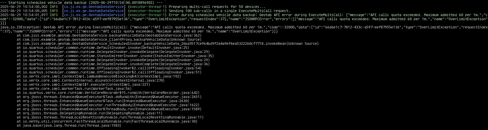

# Contents

- [geotab-backup](#geotab-backup)
  - [Running the application in dev mode](#running-the-application-in-dev-mode)
  - [SDK.](#sdk)
  - [Calls limit.](#calls-limit)
  - [Multicall.](#multicall)
  - [Solution.](#solution)


# geotab-backup

This service is done in quarkus. It is the one I have been working with.

## Running the application in dev mode

Run in local, if you have quarkus installed:

```shell script
./mvnw quarkus:dev
```

data will be saved in the directory data/vehicles-backup

## SDK.

Too late I found out that an API client for the API existed. As I had already done most of it using
http calls, I decided not to do again. If I did it again, I would of course use the SDK, but too
late for that now.

https://github.com/Geotab/sdk-java-samples

## Calls limit.

As there are 50 devices, and I am doing 2 requests for each of them, that means 100 requests a
minute. As there is a limit of 60 requests by minute, I very soon reached that limit.



## Multicall.

I tried to circumvent such limit by making a multicall with all the requests agregated in one. And
it worked for a while, until it stopped working. I had read in the documentation that maybe in the
future you would add a limit to the multicalls so that the limit could not be surpased. It seems
that the future is now, and that limit is already in place, although calculated differently, because
as I told before, there was a while where it was working.
I added a tag for the multicall version, if you want to check yourself. You could build the
container using that tag.
Tag: `multicall`



## Solution.

Not really a solution. I went back to the single calls version, and what I do is I revert the
vehicles every time, so that are different vehicles which don't have quota enough. That way all the
vehicles should be processed every 2 minutes instead of 1.

## Building and running the container.

- First clone the repository:

`git clone https://github.com/nachose/geotab_test.git`

- Create a directory to save the data.

I thought it convenient to have the data available outside the container.

```
mkdir -p $(pwd)/vehicle-backups
sudo chmod 777 $(pwd)/vehicle-backups
```
- Create the image, passing as parameter the tag `not_mcv0.1`:

`docker build --progress=plain --build-arg GIT_TAG=not_mcv0.1 -f src/main/docker/Dockerfile.jvm -t geotab-backup-app .`

Depending on how you have installed docker, you might need to sudo it:

`sudo docker build --progress=plain --build-arg GIT_TAG=not_mcv0.1 -f src/main/docker/Dockerfile.jvm -t geotab-backup-app .`

- Run the image:

`docker run -i --rm -p 8080:8080 -v $(pwd)/vehicle-backups:/app/data/vehicle-backups geotab-backup-app`

